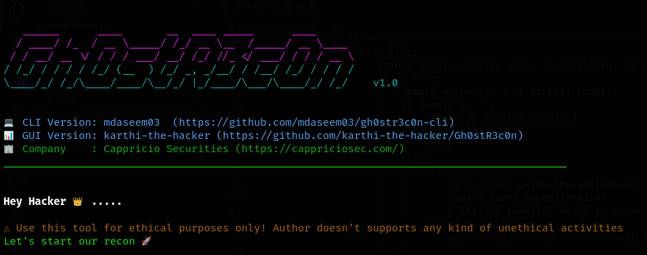

# gh0str3c0n-cli
This is a command line version of Gh0stR3c0n tool made by karthi-the-hacker. This tool helps users gather information about their target domains. It allows users to define a scope by inputting domain names, generates URLs, and performs subdomain enumeration using Subfinder. Additionally, it offers functionalities like port scanning with Naabu, web crawling, pattern matching for vulnerabilities (XSS, SQLi, etc.), and directory enumeration with tools like Dirsearch. Users can customize and extend their reconnaissance tasks based on their needs. 

## Features ⚙️ :

 - SubDomain Recon.
 - Finding IP's from Domains and Subdomains.
 - Finding Live with unique open ports.
 - Finding open ports. 
 - Directory Brute forcing and Web crawling.
 - Parameter crawling.
 - Pattern matching (RCE,IDOR,SQLI,SSRF,SSTI,Open Redirect and More).

### Required tools ⚒️ :

- [Amass](https://github.com/OWASP/Amass)
- [Subfinder](https://github.com/projectdiscovery/subfinder)
- [Naabu](https://github.com/projectdiscovery/naabu)
- [Gau](https://github.com/lc/gau)
- [dirsearch](https://github.com/maurosoria/dirsearch)
- [waybackurls](https://github.com/tomnomnom/waybackurls)
- [GF](https://github.com/tomnomnom/gf)

### Requirements 🪛 :

- [Python](https://www.python.org/)

### Screenshot 📸 :

### Video 🎥

#### Commands for Installation 🕹️ :

    $ git clone https://github.com/mdaseem03/gh0str3c0n-cli.git
    $ cd gh0str3c0n-cli/
    $ bash requirements.sh
    

#### Command to Run 🚀 :

    $ python3 gh0str3c0n.py

#### GUI Version 📊: 
- [Gh0stR3c0n](https://github.com/karthi-the-hacker/Gh0stR3c0n)
